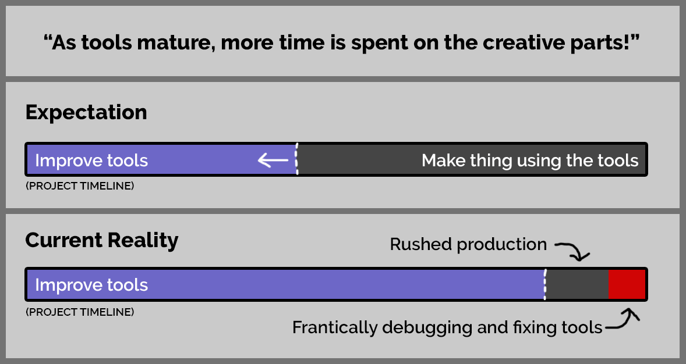
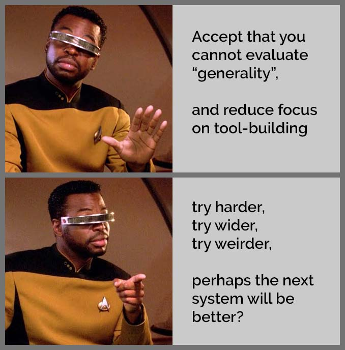

Quick notes/links for talk at Inercia 2024

-----

## The Allure of Tools...

### Q: Why is development still so tedious?

### What do we want?

 * Make dev more fun
 * Keep iteration times low 
 * Reuse for the future

Have you ever tried to develop tools for reusability?

...only to realize later that the "general" case you were designing
for was actually a lot less general than you imagined?  

## This might not be a good way to make demos in Unity

 * I use Unity, but I do it for specific features only
 * Multi-purpose, to make demos yes, but also to try out software architecture ideas.  
 * Most of these things are work in progress
 * I'm going in the direction that feels right to me, but I will probably give up on many of these ideas...

## Tools that I use:

 * Unity
   - [Why Unity?](#why-unity)
   - [How Unity]
 * Messy Demo Framework
   - Components, code that can be individually tested in the Unity Editor, (LIVE DEMO)
   - [Custom Reflection](https://github.com/teadrinker/projection-assisted-sculpting/tree/main/SARA%20Unity%20Project/Assets/Code/CustomReflection) 
   - Custom Resource System (run time hot-reloadable)
   - Custom Declarative Reactive Programming Language
 * Mad Tea Lab [(madtealab.com)](https://madtealab.com)
 * [WolframAlpha](https://www.wolframalpha.com/) for math simplification
 * vs-code / Obsidian / notepad
 * LLM:s
   - Good for: Translate code between languages
   - Good for: Generate/complete boiler plate code
   - [Not yet revolutionary.](#lmm-notes) 

## Why Unity?

### Pros

 * Great hardware support: Kinect / 3D displays / VR
 * C# with UI for realtime inspection (LIVE DEMO)
 * Multi-platform builds
 * Robust (if you stick to basics)
 
### Cons

 * No run-time creation of shaders (except [non-offical](https://github.com/witalosk/UnityRuntimeShader?tab=readme-ov-file))
 * Future/direction is controlled by corporate/investor whims (facing [enshittification risk](https://en.wikipedia.org/wiki/Enshittification))
 * Slow C# hot reload / package management
 * Lowers your demoscene street cred

## How Unity

### Minimize API-Usage

 * Only custom shaders
 * No compute shaders
 * Don't use Unity's lighting pipeline
 * Only render using MeshRenderer, not procedurally
 * Don't use the Unity timeline

### Possible replacement:

 * [Unity -> Godot adapter Experiment](https://github.com/teadrinker/united-godot?tab=readme-ov-file)

## LMM Notes

LLMs are amazing an technology, but in current practice,
it's essentially a force for the status quo in most domains.

LLMs only really excells at generating the kind of code that was plentiful when the training data was scraped. (If you do conventional gamedev in c# and Unity, an LLM will accellerate your workflow much better than if you use some new cutting edge language/platform.)

## Links

For source code: beware of poor quality!
Much of it was not cleaned up or documented properly.

 * [Mad Tea Lab (madtealab.com)](https://madtealab.com)
 * [Custom Reflection](https://github.com/teadrinker/projection-assisted-sculpting/tree/main/SARA%20Unity%20Project/Assets/Code/CustomReflection)
 * [DepthStream - Depth point cloud recording/processing/playback](https://github.com/teadrinker/projection-assisted-sculpting/tree/main/SARA%20Unity%20Project/Assets/Code/DepthStream?tab=readme-ov-file)
 * [TeaParticleShader.cginc](https://github.com/teadrinker/projection-assisted-sculpting/blob/main/SARA%20Unity%20Project/Assets/Code/TeaParticles/Resources/Shaders/TeaParticleShader.cginc) - hacky hlsl renderer for depth point cloud (as well as simpler particle system)
 * [Unity -> Godot Adapter Experiment](https://github.com/teadrinker/united-godot?tab=readme-ov-file)
